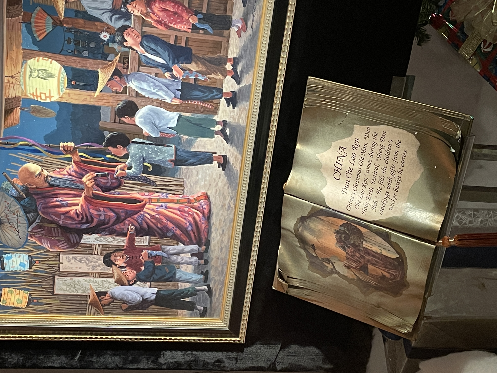

# What is "Dun Che Lao Ren"?

> TL;DR: "Dun Che Lao Ren" is probably the Cantonese pronunciation of "冬至老人" (Winter Solstice Old Man).

A few days ago, I went to Market Square in Pittsburgh with my girlfriend to see the giant Christmas tree. There was also a display window that showed the Santa Clauses in different cultures, and we found the Santa in the Chinese culture is called "Dun Che Lao Ren":

I was (officially, formally, and) definitely confused: OK, I know "Lao Ren" is "老人" (old man), but what the heck is "Dun Che"?  I could think of a few possibilities of the original Chinese:

| Original Chinese | Pronunciation in _Pinyin_ (*) | Meaning |
| 动车 | Dong Che | high-speed train |
| 蹬车 | Deng Che | pedaling the bicycle |
| 等车 | Deng Che | waiting for the bus |

Note (*): ["Pinyin"](https://en.wikipedia.org/wiki/Pinyin) is "the official romanization system for Standard Mandarin Chinese in mainland China."

None of them make much sense in the context. Being Chinese, I couldn't figure out what "Dun Che" refers to, so I searched on the Internet and found [an explanation as follows](http://www.customsofchristmas.com/china.html):

> Santa Claus does make an appearance in China where he is called **Dun Che Lao Ren, Christmas Old Man**, or Lan Khoong-Khoong, Nice Old Father.

It explains what "Dun Che Lao Ren" is equivalent to in English but doesn't tell me what "Dun Che" means precisely. "Dun Che" is undoubtedly not the Chinese translation of "Christmas" because "Christmas" is "Sheng Dan" in Chinese. Later, I found this translation has confused a lot of Chinese people.

- [什么是 "DUN CHE LAO REN"？](http://bbs.skykiwi.com/forum.php?mod=viewthread&tid=2206226)
- [DUN CHE LAO REN 是什么意思？](https://wenwen.sogou.com/z/q131716610.htm)
- [圣诞老人的翻译 - Dun che lao ren? Lan Khoong?](http://montreal-interpretation.blogspot.com/2008/12/dun-che-lao-ren-lan-khoong.html)
- [DUN CHE LAO REN 是什么意思？](https://zhidao.baidu.com/question/1174409750311823019.html)

This question has been lingering in my mind for a while. Today, when I searched for the answer on the Internet, I found several articles about the relationship between Winter Solstice Day and Christmas Day:

- [冬至大如年：圣诞曾被称为"洋冬至"？](https://cul.qq.com/a/20151222/023903.htm)
- [冬至过后，我们来谈谈圣诞](https://zhuanlan.zhihu.com/p/24484100)
- [冬至与圣诞](https://www.sohu.com/a/439500890_209011)
- [冬至与圣诞节](https://www.163.com/dy/article/E3HVV2U40516D9IQ.html)
- [清朝和民国，中国人怎么过圣诞节？老照片告诉你](https://www.163.com/dy/article/E3SLHMA20523K3VT.html)

These articles all mention that, in the past, the Chinese people considered Christmas Day as "the Winter Solstice Day that foreigners celebrate":

> 而且**冬至节**与圣诞节的时间也非常接近...
>
> 不过，在老上海眼里，圣诞节就是**"外国的冬至"**。
>
> 追溯圣诞节的起源，我们可以发现其**与冬至的密切联系**...
>
> 由于时间与冬至接近，故而被称为**外国的"冬至"**...

Here are some English articles if you only read English:

- [The Winter Solstice, is this the real Christmas?](https://ethicalbutcher.co.uk/blogs/journal/the-winter-solstice)
- [Why is Christmas Day on the 25th December?](https://www.whychristmas.com/customs/25th.shtml)
- [History of Christmas: How Did Christmas Start?](https://www.history.com/topics/christmas/history-of-christmas#how-did-christmas-start)

**It occurred to me that maybe "Christmas Old Man" was called "Winter Solstice Old Man" by the Chinese people in the past.** This is because in Mandarin, "Winter Solstice" is pronounced as "Dong Zhi" which sounds a little bit similar to "Dun Che." However, because [Cantonese also influences the English words with Chinese origins](https://yaobinwen.github.io/English/Essays/2021/2021-12-15-List-of-English-words-of-Chinese-origin.html), **it is possible that "Dun Che" comes from the Cantonese pronunciation of "Winter Solstice."**

So I asked a friend who speaks Cantonese, and she confirmed my guess:

And I believe this is an excellent guess.
