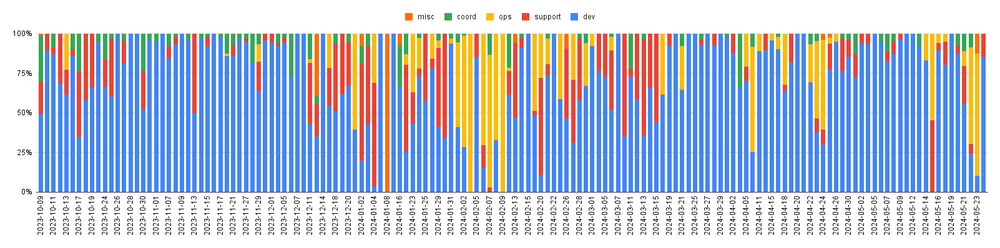
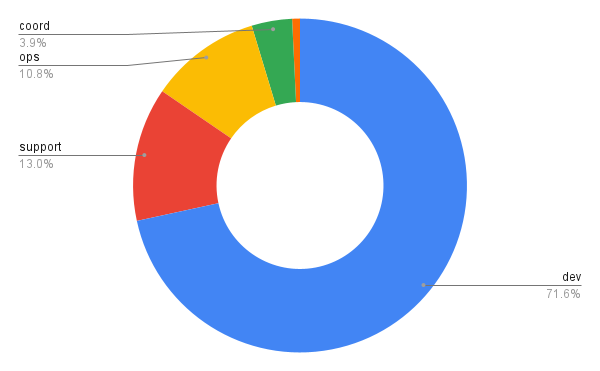

## Hi there 👋

This is Yaobin, a software developer. [Happy Hour 🍻](https://github.com/users/yaobinwen/projects/3/views/1) is my personal task tracker.

### What kind of person I am

**I always try to understand the internals of the technologies.** For example:
- [yaobinwen/ssh-tunneling-explained](https://github.com/yaobinwen/ssh-tunneling-explained) explains what SSH tunneling is and how to use it.
- [yaobinwen/cpp-static-dynamic-linking](https://github.com/yaobinwen/cpp-static-dynamic-linking) explains how GCC static linking and dynamic linking should be configured to work.
- [yaobinwen/git-log-S-G](https://github.com/yaobinwen/git-log-S-G) explains how `git log -S` and `git log -G` work using the repository itself as an example.
- [yaobinwen/backporting-gl2ps](https://github.com/yaobinwen/backporting-gl2ps) discusses the issue I ran into when backporting [`gl2ps`](https://geuz.org/gl2ps/) from Ubuntu Impish to Ubuntu Bionic by looking deep into two packages: `debhelper` and CMake.
- **To verify whether I truly understand the technologies, I try to explain them in my own words.** Therefore, I maintain my own tech blog at [yaobinwen.github.io](https://yaobinwen.github.io/) which discusses computer-related technologies, including explaining the topics I've just learned in my own words. This serves two purposes: I can verify if I truly understand the topics; the readers can learn the topics more easily.

**I am willing to dive into the source code in order to understand the magic behind the scenes.** For example:
- [yaobinwen/systemd-networkd-ubuntu](https://github.com/yaobinwen/systemd-networkd-ubuntu) contains the source code of [`systemd-networkd`](https://www.freedesktop.org/software/systemd/man/latest/systemd.network.html) with my comments/notes and I studied the code to solve a network misconfiguration that I ran into at work.
- [yaobinwen/openvpn-ubuntu](https://github.com/yaobinwen/openvpn-ubuntu) contains the source code of [OpenVPN](https://openvpn.net/) that I studied to figure out the OpenVPN configuration issues I ran into at work.
- [yaobinwen/learn-consul](https://github.com/yaobinwen/learn-consul) contains the code of [Hashicorp Consul](https://github.com/hashicorp/consul) that I studied to figure out some of Consul's exact behaviors.
- [yaobinwen/learn-linux-kernel](https://github.com/yaobinwen/learn-linux-kernel) is still a work in progress but my goal is to learn how to hack Linux kernel code which also helps me understand better how Linux works.
- [yaobinwen/dpkg](https://github.com/yaobinwen/dpkg): I work on Ubuntu and manage the Debian package building and publishing in my company, so I use [dpkg(1)](https://manpages.ubuntu.com/manpages/bionic/en/man1/dpkg.1.html) a lot. I forked the source code in order to learn the tool and **Perl**. See my README file [dpkg: Annotated Version](https://github.com/yaobinwen/dpkg/blob/master/README.md).
  - Along with `dpkg(1)`, I also use [yaobinwen/debhelper](https://github.com/yaobinwen/debhelper) tool suite.

**I always try to prioritize learning the fundamental knowledge over the high-level, trending technologies.**
- By "fundamental knowledge" I mean as follows:
  - Operating system (this is why I started the [learn-linux-kernel](https://github.com/yaobinwen/learn-linux-kernel) project)
  - Networking; TCP/IP
  - Data structures and algorithms
  - Mathematics (this is why I started the [yaobinwen/Robin-on-Math](https://github.com/yaobinwen/Robin-on-Math) project to re-learn math after leaving school for many years)
  - etc.
- This doesn't mean that I don't want to learn the high-level knowledge. It just means I believe grasping the fundamental knowledge can boost the learning of the high-level knowledge.
- Also, trends come and go; fundamentals stay.

**I am a good team player** because I am willing to step out of my comfort zones to work on the tasks that require the technologies even if I have zero experience before, as long as the team need.
- This team-oriented spirit gives me the opportunities to use a broad range of technologies from the low-level ones (e.g., Linux kernel, system administration) all the way up to the high-level ones (e.g., React.js). This gives me the chance to learn how to develop a full product and also allows me to work on a wide range of things that can support the team better.
- However, I am also aware that the disadvantage of working on a broad range of technologies is it's difficult for me to become really good at one specific area. I have to admit this is probably the inevitable loss when I enjoy the gain.
- But I do have my preference: After working on various technologies, I want to spend more time working on the system-level technologies such as Linux kernel, C/C++ libraries, networking, etc. (This is why I started the project [yaobinwen/learn-linux-kernel](https://github.com/yaobinwen/learn-linux-kernel) to learn Linux kernel.)

**I learn by practicing**, so I have a few "sandboxes" that allow me to experiment with the technologies I'm learning. For example:
- [yaobinwen/web-box](https://github.com/yaobinwen/web-box) is the project I use to learn web technologies of the following:
  - Raw HTML + CSS + JavaScript
  - node.js
  - React.js + MUI
  - Tornado web server
- [yaobinwen/robin_on_rails](https://github.com/yaobinwen/robin_on_rails) contains the notes or thoughts that I took when I read technical articles. The notes and thoughts in this repository may not be well structured yet,and my plan is to gradually turn them into articles once I've accumulated enough in the related topics. The repository also includes a few folders for experimental code, such as:
  - [C_Cpp/code](https://github.com/yaobinwen/robin_on_rails/tree/master/C_Cpp/code) has my code of learning C/C++.
  - [Protocol-Buffers/demo](https://github.com/yaobinwen/robin_on_rails/tree/master/Protocol-Buffers/demo) has my code of learning Protocol Buffers.
  - [Python](https://github.com/yaobinwen/robin_on_rails/tree/master/Python) has my code of learning Python.

**I always try to communicate as clear as possible.** This includes writing clear and easy-to-follow documentation.
- I have to admit that writing good document is a difficult task. This difficulty motivated me to start the project [yaobinwen/document-shredded](https://github.com/yaobinwen/document-shredded) which collects documentation good practices with examples and bad practices with counter-examples in order to create a repeatable process of creating easy-to-understand documentation.

**I track my time usage so I can tell where I spend my time.** This gives me a few benefits:
- I can tell whether the way I spend my time aligns with my goals. For example, if my new-year resolution is reading more, but I only spend one hour per week on reading after 3 months according to my time tracking log, obviously I'm not achieving my goal. Then I can figure out why I didn't spend enough time on reading. Maybe I didn't build up the habit yet, so I need to make personal adjustments; maybe my goal was not feasible in my current situation at all no matter how hard I work on it, so I need to adjust my goal. Either way, I wouldn't be able to get the insight without time tracking.
- I can tell my actual time of working on development tasks, e.g., 70%. This allows me to make better estimates on future tasks so I know if my estimate of a task is 1 day (assuming 8 hours), I may actually need about 1.5 days to finish it.
- Example snapshot of my personal time tracking (using [Toggl](https://toggl.com/)):

- Example snapshots of my time tracking for work (using Google Sheets and [Xpad](https://launchpad.net/ubuntu/+source/xpad) for simplicity):

### Other repositories

- [yaobinwen/work-env](https://github.com/yaobinwen/work-env) contains the scripts, guides, and programs that help me quickly set up my own work environment.
- [yaobinwen/local-https](https://github.com/yaobinwen/local-https): Deploy a local HTTPS web service which is good for local testing and experimenting.
